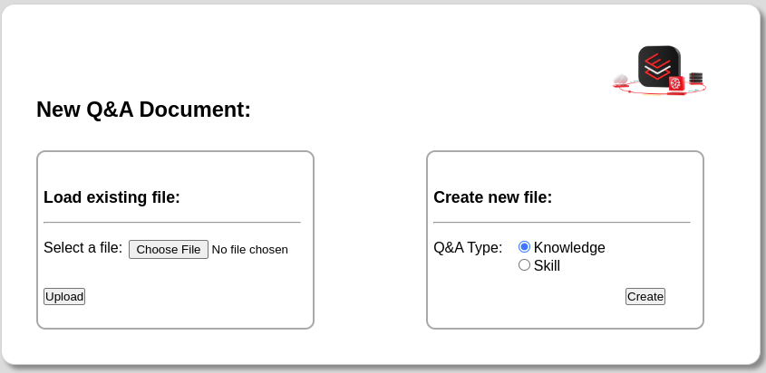
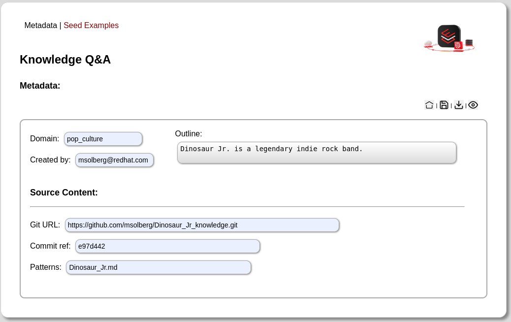
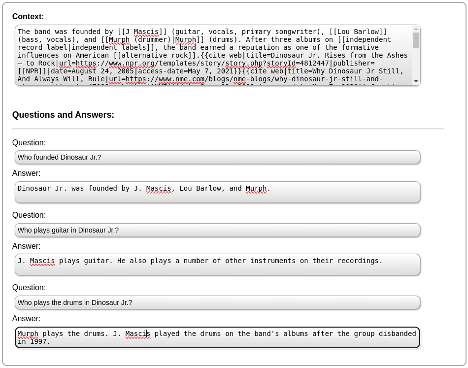
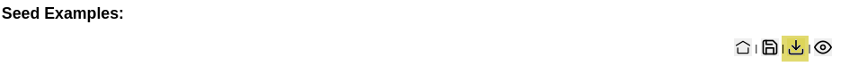

# AI Odyssey 2025 demo-project
<div align="center">

</div>
<br/>

## Demo Deployment Instructions
This project is a graphical QNA editor which makes editing QNA files for InstructLab easy and fun! To try it out, you can simply run the container on any machine with the following command:

```
$ podman run -i --rm -p 8080:8080 quay.io/ajhajj/qna-editer
```

Open it up in a web browser and get to work!

More detailed instructions on how to work this into a workflow using the Red Hat Demo System follow.

## Name
QNA Editor

## Description
The QNA Editor is a graphical user interface for writing questions and answers for use in customizing LLMs with InstructLab. It is written in Quarkus as a standalone web application and can be easily deployed as a container.

## Deploying on RHEL AI
Here are instructions on integrating the QNA editor into your RHEL AI workflow.

First, order the "RHEL AI (GA) VM" item from demo.redhat.com. After it provisions, you'll see log in information in the "Details" tab. SSH into your VM and set up InstructLab. When logging into the host with SSH, set up port forwarding for port 8080 so that you can access the interface for QNA Editor like this:

```
ssh -L8080:127.0.0.1:8080 instruct@bastion.rk5z4.sandbox1032.opentlc.com
```

### Initialize InstructLab
```
$ ilab config init
```

You should see the following output and a confirmation prompt:

```
Welcome to InstructLab CLI. This guide will help you to setup your environment.
Please provide the following values to initiate the environment [press Enter for defaults]:
Cloning https://github.com/instructlab/taxonomy.git...
Generating `/var/home/instruct/.config/instructlab/config.yaml`...
Detecting Hardware...
We chose Nvidia 1x L4 as your designated training profile. This is for systems with 24 GB of vRAM.
This profile is the best approximation for your system based off of the amount of vRAM. We modified it to match the number of GPUs you have.
Is this profile correct? [Y/n]: Y
Initialization completed successfully, you're ready to start using `ilab`. Enjoy!
```

In our demo environment, we need to configure the number of GPUs available to the model. Run

```
$ ilab config edit
```

And change 'tensor-parallel-size' from 4 to 1. See https://access.redhat.com/solutions/7092034 for more information.

Additional information on initializing InstructLab is available here:

https://docs.redhat.com/en/documentation/red_hat_enterprise_linux_ai/1.1/html/building_your_rhel_ai_environment/initializing_instructlab

### Download Models
Next, log into the Red Hat image registry:

```
$ podman login registry.redhat.io
```

Download the necessary models:

```
$ ilab model download --repository docker://registry.redhat.io/rhelai1/granite-7b-starter --release latest
$ ilab model download --repository docker://registry.redhat.io/rhelai1/mixtral-8x7b-instruct-v0-1 --release latest
$ ilab model download --repository docker://registry.redhat.io/rhelai1/prometheus-8x7b-v2-0 --release latest

```

More information on downloading models for InstructLab is available here:
https://docs.redhat.com/en/documentation/red_hat_enterprise_linux_ai/1.1/html/building_your_rhel_ai_environment/downloading_ad_models

### Launch the QNA Editor
Pull the QNA Editor image from Quay.io:

```
podman pull quay.io/ajhajj/qna-editor
```

Get the image ID from the podman listing and run the container, forwarding port 8080.

```
$ podman images
REPOSITORY                 TAG         IMAGE ID      CREATED     SIZE
quay.io/ajhajj/qna-editor  latest      91ab06de857d  2 days ago  439 MB
$ podman run -i --rm -p 8080:8080 91ab06de857d
```
In the above example, the image ID is "91ab06de857d".

You should now be able to access the QNA editor by pointing your web browser to http://localhost:8080/.

## Usage
Once you've installed the required models and started the QNA Editor, you can begin customizing your LLM.

In this example, we'll be teaching our model all about the legendary indie rock band Dinosaur Jr. To train our model, we'll need to start with some knowledge. For this exercise, I've taken the Wikipedia article on Dinosaur Jr and placed it in a Git repository (https://github.com/msolberg/Dinosaur_Jr_knowledge).

### Establishing the Baseline
For testing, we'll be asking a set of questions as a baseline to see how much knowledge the model already has about the subject.
Start the chatbot in one SSH session with the following command.

```
$ ilab model serve --model-path ~/.cache/instructlab/models/granite-7b-starter
```

In another session, chat with the bot with the following command.

```
$ ilab chat --model /var/home/instruct/.cache/instructlab/models/granite-7b-starter
```

Let's ask a few questions about the band and see how it does.

```
>>> Who founded Dinosaur Jr.?                                       [S][default]
╭───────────────────────────── granite-7b-starter ─────────────────────────────╮
│ Dinosaur Jr. was founded by J Mascis, Lou Barlow, and Murph. J Mascis is a   │
│ vocalist, guitarist, and songwriter who was a key figure in the Boston indie │
│ rock scene. Lou Barlow is a vocalist, guitarist, and songwriter who is best  │
│ known for his work with Dinosaur Jr. and the band Spoon. Murph is a          │
│ vocalist, guitarist, and songwriter who has played with various bands,       │
│ including Dinosaur Jr. The band's early albums showcased a raw, punk rock    │
│ sound, but they later developed a more mature, alternative rock sound.       │
╰────────────────────────────────────────────────────── elapsed 7.308 seconds ─╯
>>> Who plays guitar in Dinosaur Jr.?                               [S][default]
╭───────────────────────────── granite-7b-starter ─────────────────────────────╮
│ J Mascis is the guitarist in Dinosaur Jr. He is a vocalist, guitarist, and   │
│ songwriter who is a key figure in the Boston indie rock scene. Mascis        │
│ founded Dinosaur Jr. and has been the band's primary songwriter and          │
│ guitarist throughout their career.                                           │
╰────────────────────────────────────────────────────── elapsed 3.395 seconds ─╯
>>> Who plays the drums in Dinosaur Jr.?                            [S][default]
╭───────────────────────────── granite-7b-starter ─────────────────────────────╮
│ Murph is the drummer in Dinosaur Jr. He is a vocalist, guitarist, and        │
│ songwriter who has played with various bands, including Dinosaur Jr. Murph   │
│ joined Dinosaur Jr. in 1984 and has been a constant presence in the band     │
│ ever since.                                                                  │
╰────────────────────────────────────────────────────── elapsed 3.460 seconds ─╯
>>> What song did Dinosaur Jr. cover on their 1989 record?          [S][default]
╭───────────────────────────── granite-7b-starter ─────────────────────────────╮
│ Dinosaur Jr. covered the song "Born to Be Bad" on their 1989 record "Where   │
│ You Been?". This song was originally performed by the band XTC. The cover    │
│ version of "Born to Be Bad" by Dinosaur Jr. was well-received by critics and │
│ fans alike, and it helped establish the band's reputation as a innovative    │
│ and influential force in indie rock. The cover version of "Born to Be Bad"   │
│ by Dinosaur Jr. is considered to be one of the band's most iconic and        │
│ enduring works.                                                              │
╰────────────────────────────────────────────────────── elapsed 7.111 seconds ─╯
```

Three out of four isn't bad, but that last one is a complete fabrication. Dinosaur Jr. covered "Just Like Heaven" by The Cure on their 1989 record "Bug" and "Born to be Bad" is not an XTC song. We've got some training to do!

### Creating the QNA file for our knowledge
To create our QNA file, open up the QNA editor in a Web Browser. If you forwarded port 8080 on your local computer using SSH, you'll access the editor at http://127.0.0.1:8080/

When you first access the editor, you'll be given the option to either upload an existing QNA file or create a new one. We'll be creating a new one for this example.



The editor supports creating both knowledge and skill QNA documents, but we'll be working with a knowledge QNA document. Click "Create" to get started.

The next page is the Metadata Editor. Fill out the form with the following information.

**Domain** pop_culture

**Created by** You!

**Outline** Dinosaur Jr. is a legendary indie rock band.

**Git URL** https://github.com/msolberg/Dinosaur_Jr_knowledge.git

**Commit ref:** 91540a8

**Patterns:** Dinosaur_Jr.md




This tells the model that we're going to be using the Wikipedia article that I committed to a git repository and also which commit to pull. It also identifies the file in the repository which contains the knowledge as "Dinosaur_Jr.md".

Now on to the fun part. Click on "Seed Examples" at the top of the form to access the question and answer section.

Copy a section from the wikipedia article [here](https://github.com/msolberg/Dinosaur_Jr_knowledge/blob/main/Dinosaur_Jr.md) into the "Context" box.
Then enter some questions and answers which reference that section of the text.



Continue copying sections of the article into the "Context" boxes and adding questions and answers about those sections to the question and answer boxes. You must have five context sections with three questions and answers to be able to customize an LLM.



When you're done, click the download button at the top of the page to download your QNA file.

### Customizing your LLM using the QNA file.

Start by copying your downloaded QNA file up to the RHEL AI VM.

```
$ scp qna.yaml instruct@bastion.rk5z4.sandbox1032.opentlc.com:qna.yaml
```

Make a directory within the InstructLab taxonomy and copy your qna file into it.

```
$ mkdir -p .local/share/instructlab/taxonomy/knowledge/pop_culture/dinosaur_jr/
$ cp qna.yaml .local/share/instructlab/taxonomy/knowledge/pop_culture/dinosaur_jr/
```

Run the instructlab taxonomy checker to make sure that the syntax and set up are correct:

```
$ ilab taxonomy diff
```

You should see output similar to the following:

```
compositional_skills/grounded/linguistics/inclusion/qna.yaml
compositional_skills/grounded/linguistics/writing/rewriting/qna.yaml
compositional_skills/linguistics/synonyms/qna.yaml
knowledge/science/animals/birds/black_capped_chickadee/qna.yaml
knowledge/pop_culture/dinosaur_jr/qna.yaml
Taxonomy in /var/home/instruct/.local/share/instructlab/taxonomy is valid :)
```

Next, create some synthetic content using the mixtral model. In one SSH session to the VM, start the mixtral model:

```
$ ilab model serve --model-path ~/.cache/instructlab/models/mixtral-8x7b-instruct-v0-1
```

In the other session, run the generation command

```
$ ilab data generate
```

